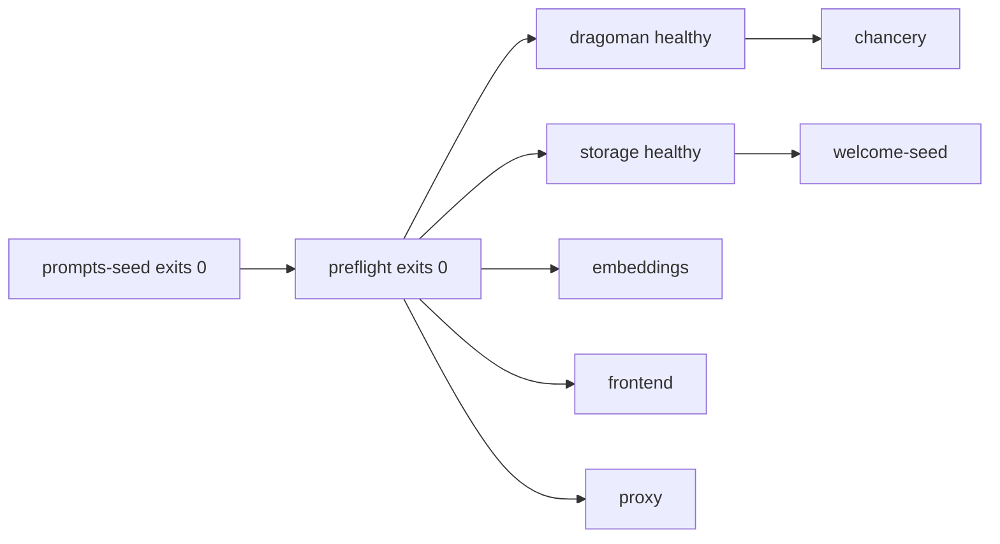

# Compose

The compose file is the deploy artifact of nabu-self-hosted: nine services — six long-running, three one-shot — built from git contexts, this repo's own directories, or `dockerfile_inline`, with a `.env` whose knobs are the only thing a user touches.

## Contract

The contract is enforced declaratively: the compose file itself is the artifact, `docker compose config` machine-checks its shape and interpolation, startup order is `depends_on` conditions against image `HEALTHCHECK`s and init exit codes rather than wait scripts, and hostile knob values are parsed by the mechanism that consumes them — a bad `MODELS` is a filename that fails to resolve inside the seed image, a `STORAGE_DATA` value is read by compose's own volume short syntax, and provider keys pass only as environment, never interpolated into a command.

### Services

| Service | Image source | Internal port | Health signal |
| --- | --- | --- | --- |
| proxy | stock `caddy:2-alpine` with this repo's Caddyfile bind-mounted ([proxy.md](proxy.md)) | 8090 | compose-declared probe of its own `/health` |
| frontend | git context `nabu-frontend` (own Dockerfile) | 8080 | `HEALTHCHECK` baked in the image |
| storage | git context `nabu-storage` (own Dockerfile) | 8080 | baked: the binary's `healthcheck` subcommand |
| embeddings | git context `nabu-embeddings`, `dockerfile_inline`: stock Caddy plus the repo's Caddyfile | 8082 | compose-declared probe of its `/health` |
| chancery | git context `chancery` (own Dockerfile) | 8081 | baked: the binary's `healthcheck` subcommand |
| dragoman | git context `dragoman` (own Dockerfile) | 8080 | baked: the binary's `healthcheck` subcommand |
| prompts-seed | git context `nabu-prompts`, `dockerfile_inline`: a minimal image holding the repo's `config/` | none | exit code (init service) |
| preflight | built from this repo's own `preflight/` directory; its Dockerfile takes the dragoman service's image as an additional build context, copies the binary out, and captures `dragoman config` — the embedded service table of the exact image the stack runs — as the check's table input; check contract in [preflight.md](preflight.md) | none | exit code (init service) |
| welcome-seed | built from this repo's own `seed/` directory; seed contract in [welcome-seed.md](welcome-seed.md) | none | exit code (one-shot, runs after storage is healthy) |

Every git context is a pinned `https://github.com/mdijkstra-oss/<repo>.git#main` URL, so a machine holding no clone and no toolchain builds the whole stack; each is overridable with a `*_REPO` variable whose value may be a local path, which is the side-by-side development mode inherited from nabu-prompts.

nabu-embeddings and nabu-prompts carry no Dockerfile, so their services pair the git context with `dockerfile_inline` — BuildKit documents building a remote git context with a supplied Dockerfile, and the compose build spec allows a git `context` beside `dockerfile_inline` — keeping every internal detail in the compose file rather than patching those repos. Two build mechanisms want a smoke test before anything else is built on them: the `dockerfile_inline`-over-git-context pair, and the preflight's `additional_contexts` reference to the dragoman service's image.

The proxy's port mapping is `${NABU_PORT:-8090}` on the host to 8090 in the container: the knob moves only the host side, and it is the stack's ONLY published port — storage, chancery, dragoman, embeddings, and the frontend publish nothing, which is what keeps dragoman's unauthenticated key-holding listener and storage's unauthenticated data listener unreachable from outside the compose network. What the proxy routes to each service is owned by [proxy.md](proxy.md).

### Hardcoded internals

- frontend build args: `VITE_API_HOST=/api`, `VITE_LLM_HOST=/llm`, `VITE_EMBEDDINGS_URL=/embeddings` — the same-origin values whose interpretation is owned by [frontend-same-origin.md](frontend-same-origin.md); `VITE_EMBEDDINGS_MODEL` and `VITE_EMBEDDINGS_DIMENSIONS` are left unset so the defaults in nabu-frontend's `app/lib/embeddings/env.ts` hold.
- chancery: `RESPONSES_BASE_URL=http://dragoman:8080` (its one required variable, reaching dragoman by service name), `ENV=production`; `PORT` and `LOG_REQUEST_HEADERS` are left to the code's defaults.
- storage: `PERSISTENCE_DIR=/data`, the path its image prepares for an unprivileged user — the server refuses to boot without it.
- dragoman: runs on its image defaults with no config mount, because its embedded service table already names `openai`, `anthropic`, `gemini`, and `deepseek` — every provider prefix the models presets use — with exactly the `*_API_KEY` variable names compose passes (verified against `dragoman/internal/config/dragoman.yaml`); it receives all five key variables, `OPENROUTER_API_KEY` included, so every provider its table names can be keyed and a bring-your-own models yaml that passes preflight never dies keyless at first request.
- CORS: no service receives a CORS variable, because every browser request is same-origin behind the proxy — the reasoning is owned by [proxy.md](proxy.md).

### Env knobs (`.env.example`)

| Field | Default | Consumer |
| --- | --- | --- |
| `OPENAI_API_KEY` | empty | dragoman's embedded `openai` entry; the embeddings Caddyfile's `{env.OPENAI_API_KEY}`; [preflight.md](preflight.md) |
| `ANTHROPIC_API_KEY` | empty | dragoman's `anthropic` entry, exercised by the `anthropic` and `multi` presets |
| `GEMINI_API_KEY` | empty | dragoman's `gemini` entry, exercised by the `gemini` and `multi` presets |
| `DEEPSEEK_API_KEY` | empty | dragoman's `deepseek` entry, exercised by the `deepseek` preset |
| `OPENROUTER_API_KEY` | commented out | dragoman's embedded `openrouter` entry, reachable only from a bring-your-own models yaml |
| `MODELS` | `openai` | prompts-seed: selects `config/models.<MODELS>.yaml` as chancery's `models.yaml` |
| `MODELS_FILE` | commented out | prompts-seed: a host path to the user's own models yaml, used instead of any preset |
| `NABU_PORT` | `8090` | host side of the proxy's published port |
| `STORAGE_DATA` | `projects` | source of storage's `/data` mount: the default `projects` is a named volume the compose file declares; any other value must be a `./` or absolute host path for a bind mount, because named volumes are declared statically and an undeclared bare name fails `docker compose config`; a bind-mounted directory must be writable by uid 65532, storage's fixed container user — a named volume handles that itself, a host directory needs it granted |
| `NABU_FRONTEND_REPO`, `NABU_STORAGE_REPO`, `NABU_EMBEDDINGS_REPO`, `NABU_PROMPTS_REPO`, `CHANCERY_REPO`, `DRAGOMAN_REPO` | commented out | per-service build-context override for side-by-side development |

### Models selection

The prompts-seed service owns it: on every start it replaces the contents of an internal named volume wholesale with its image's `config/` — replace, not merge, so a prompt file deleted upstream disappears here too — then resolves which models yaml becomes `models.yaml` in that volume.

`MODELS_FILE`, when set, wins: compose bind-mounts it read-only into the seed at a fixed path, the seed copies it over `models.yaml`, and `MODELS` is ignored; when unset, the mount interpolates to `/dev/null`. The seed receives the variable itself and judges the mount target by it: unset means the target is ignored whatever it is (the null device, or the directory some Docker Desktop versions materialize instead); set means the target must be a regular readable file, and anything else — including the empty directory Docker creates when the host path does not exist — exits non-zero naming the path, so a typo'd `MODELS_FILE` never silently falls back to a preset; set to the empty string counts as unset.

Otherwise the seed copies `config/models.<MODELS>.yaml` over `models.yaml`; the name is used as a filename lookup inside the seed's own image, so a value naming no preset fails the copy, and the seed exits non-zero listing the presets that do exist (`openai`, `anthropic`, `gemini`, `deepseek`, `multi` in today's nabu-prompts).

Chancery mounts the volume read-only at `/config`, the path its image's working directory makes the default config dir, so the seeded tree is the entire prompt-and-models configuration chancery serves.

### Ordering

The diagram's one argument: nothing serves before the preflight has passed.

preflight gates on prompts-seed with `service_completed_successfully` and mounts the seeded volume read-only, because the resolved `models.yaml` is what it derives required keys from; its service-table input is captured at build by running `dragoman config` from the dragoman service's own image, so the two tables agree whenever the stack is built together; a partial rebuild (`docker compose build dragoman` alone) can skew them until the next full build, which is why the README's update instruction is a full `docker compose build`; it also receives the five provider key variables — what it checks is owned by [preflight.md](preflight.md), compose owns only this wiring.

Every long-running service gates on preflight with `service_completed_successfully`; chancery additionally gates on dragoman's health condition, inherited from nabu-prompts, because `depends_on` alone waits for start rather than for listening.

welcome-seed gates on storage's health condition and nothing gates on it — its failure leaves the stack serving with an empty project list, the pre-seed behavior; what it does is owned by [welcome-seed.md](welcome-seed.md).

One-shot services carry no restart policy and the long-running six carry `restart: unless-stopped`, so a failed preflight aborts the `up` and leaves the stack down with one explanatory exit rather than restart-looping.

### Side effects at the boundary

- Build time: fetches from github.com for six git contexts, and base-image pulls; nothing else leaves the machine.
- Disk: the storage volume (or the user's `STORAGE_DATA` directory) is written by storage alone and survives `down`; the prompts volume is rewritten by the seed on every start and is disposable.
- Runtime network egress: only dragoman and the embeddings service reach providers, under their own contracts; compose adds no other outbound path.

## Prior art

`nabu-prompts/compose.yaml` is the thing this component EXTENDS: it already builds chancery and dragoman from git-URL contexts with `CHANCERY_REPO`/`DRAGOMAN_REPO` local-path overrides, mounts its config dir into chancery read-only, wires `RESPONSES_BASE_URL=http://dragoman:8080`, publishes nothing of dragoman, and health-gates chancery on dragoman — this spec adds the other four services, the init gating, and the seed that replaces the local config mount.

`nabu-storage/compose.yaml` and its Dockerfile supply the storage conventions reused here: a named volume on `/data`, `PERSISTENCE_DIR` as the mount point, and the binary's self-healthcheck; `nabu-embeddings/compose.yaml` supplies the stock-Caddy-plus-Caddyfile shape its service keeps.

Online: getsentry/self-hosted is the pattern — a deploy-only repo the user clones, fills an env file, and composes up; docker/BuildKit documents git-URL build contexts and building a remote context with a supplied Dockerfile; compose's `service_completed_successfully` condition is the standard init-container idiom.

Rejected close candidates, one line each:

- Pre-built registry images — rejected: the project is not feature-complete, so every service builds from source at its `#main`.
- Kubernetes/Helm — rejected: single-user self-host; one compose file is the whole orchestration budget.
- Vendoring the nabu-prompts config into this repo — rejected: a vendored copy forks the prompts; the repo's settled contents are named in [spec.md](spec.md).
- Baking the prompts config into chancery's image via `additional_contexts` — rejected: requires patching chancery's Dockerfile, and turns every prompt or preset change into a rebuild instead of a restart.
- Vendoring a dragoman.yaml as nabu-prompts does — rejected: a copy drifts from dragoman's embedded table; dragoman runs on its embedded default and preflight captures that same table from the built dragoman image via `dragoman config`.
- Surfacing chancery's `AUTH_JWT_*` knobs — rejected: the stack is unauthenticated by design, and the bundled frontend sends no `Authorization` header, so enabling chancery's JWT auth would lock out the stack's own app.
- Surfacing `LOG_LEVEL`/`ENV`/CORS knobs from nabu-prompts' `.env.example` — rejected: outside the settled knob surface, and CORS is moot behind a single origin ([proxy.md](proxy.md)).

## Tests

1. Skeleton — this component's leg of the walking skeleton in [spec.md](spec.md): from a clean clone with a `.env` containing only `OPENAI_API_KEY`, `docker compose up` builds every image from its git context on a machine holding no component checkout, prompts-seed and preflight exit zero, all six long-running services reach healthy, and exactly one host port answers; the round trips through that port belong to [proxy.md](proxy.md)'s skeleton.

2. Contract — given/when/then, riskiest first.
   Given an empty `.env`, when the stack is brought up, then preflight exits non-zero and not one long-running service starts — the `service_completed_successfully` gate propagates to all six (the verdict itself is [preflight.md](preflight.md)'s to test).
   Given the stack is up, when the host's ports are scanned, then `${NABU_PORT}` is the only listener the stack added — dragoman's and storage's unauthenticated listeners are unreachable from the host.
   Given `MODELS=nonexistent`, when the stack is brought up, then prompts-seed exits non-zero naming the presets that exist, and chancery never starts.
   Given `MODELS=anthropic` and `ANTHROPIC_API_KEY` set, when chancery is up, then its tiers resolve to `anthropic/` models — the preset landed as chancery's `models.yaml`.
   Given `MODELS_FILE` pointing at a user yaml alongside a contradictory `MODELS`, when chancery is up, then tiers resolve to the file's models — the file wins and the preset is ignored.
   Given projects written through the stack, when it is taken down without removing volumes and brought back up, then storage serves the same projects; and given `STORAGE_DATA` names a host directory writable by uid 65532, then the project files appear in that directory and survive `down -v` (on a native-Linux host an unwritable directory crash-loops storage — the contract's stated precondition).
   Given `CHANCERY_REPO` (or any `*_REPO`) points at a local working copy, when the stack builds, then that service's image is built from the working copy and an uncommitted change in it is visible in the running container.
   Given a stale prompts volume from an earlier boot, when the stack restarts with a newer nabu-prompts image in which a prompt file was deleted, then the file is absent from chancery's `/config` — the seed replaced, not merged.
   Given `MODELS_FILE` naming a host path that does not exist, when the stack is brought up, then the seed exits non-zero naming the path — Docker's created-empty-directory stands in for the file, and the seed refuses it rather than falling back to a preset.
   Given a fresh stack on an empty storage volume, when everything reaches healthy, then storage lists exactly one project — welcome-seed ran once after storage's healthcheck passed (the seed's own behavior is [welcome-seed.md](welcome-seed.md)'s to test).

3. Isolation — compose wiring is testable without booting the stack: `docker compose config` under a chosen `.env` renders the resolved model, and assertions run against that output — one published port, no CORS variable on any service, every build context resolving to the pinned URL or the override path, the `depends_on` conditions present on every service; ordering behavior runs against fakes honoring the neighbors' linked contracts — each git context swapped via its `*_REPO` override for a stub image that listens on the real service's internal port and passes its healthcheck, while the real preflight is driven to each exit branch by the environment (a full key set for 0, an empty one for 1) to observe both sides of the gate; the seed is tested alone by running its container against a scratch volume across `MODELS` and `MODELS_FILE` inputs and inspecting the volume's resulting `models.yaml`.
