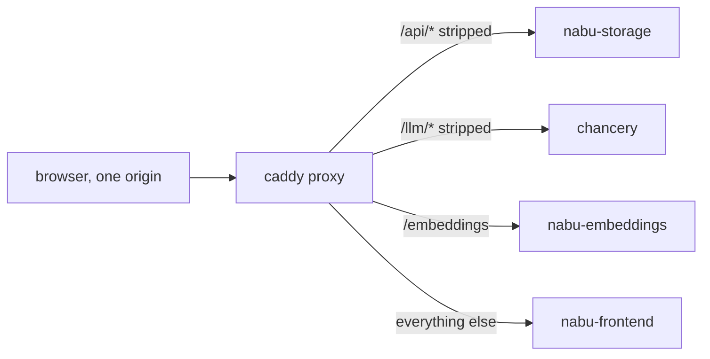

# Proxy

Caddy is the single published origin of the stack: one container, one port (owned by [compose.md](compose.md)), routing every browser request to the internal service that owns the path.

## Contract

The contract is the path map below, enforced as a declarative Caddyfile: routing is configuration, not code, so the file that ships is the contract itself.

| Public path | Upstream service | Transformation | Consumer |
| --- | --- | --- | --- |
| `/api/*` | nabu-storage | strip the `/api` prefix | frontend `app/lib/server` modules, see rows below |
| `/api/commands/{projectId}` POST | nabu-storage | → `/commands/{projectId}` | `nabu-frontend` `app/lib/server/sync/commands.ts` |
| `/api/ws/{projectId}` GET | nabu-storage | → `/ws/{projectId}`, WebSocket upgrade passed through | `nabu-frontend` `app/lib/server/sync/websocket.ts` |
| `/api/queries/projects` GET | nabu-storage | → `/queries/projects` | `nabu-frontend` `app/lib/server/api/queries.ts` |
| `/api/health` GET | nabu-storage | → `/health` | operator with curl, probing storage through the origin |
| `/llm/*` POST | chancery | strip the `/llm` prefix; chancery serves `POST /<agent-path>` and `POST /<agent-path>/responses` ([chancery-responses.md](chancery-responses.md)) | `nabu-frontend` `app/lib/agent/client/fetch.ts` |
| `/llm/health` GET | chancery | → `/health` | operator with curl, probing chancery through the origin |
| `/embeddings` POST | nabu-embeddings | path unchanged; the embeddings service's own Caddy rewrites it to the OpenAI upstream | `nabu-frontend` `app/lib/embeddings/client.ts` |
| `/health` GET | the proxy itself | answered directly with `200 ok`, no upstream involved | compose healthcheck, operator with curl |
| everything else | nabu-frontend | path unchanged; the frontend's own Caddy serves the bundle and answers deep links with `/index.html` | the browser loading and reloading the app |

Health: the proxy answers `/health` itself so the published origin reports liveness even when every upstream is down; this shadows the frontend's `/health` at the public origin, which is fine because that route exists for the frontend's own container healthcheck, not for the browser. Storage and chancery stay probeable through their prefixes (`/api/health`, `/llm/health`); nabu-embeddings' `/health` is unreachable from outside because only the exact `/embeddings` path maps through, and its healthcheck runs internally on the compose network ([compose.md](compose.md)).

WebSocket: the upgrade on `/api/ws/{projectId}` passes through — Caddy's reverse proxy forwards the `Connection`/`Upgrade` handshake by default, so the contract is that a `wss://origin/api/ws/{id}` open reaches nabu-storage's `GET /ws/{projectId}` handler, which replays the project's files as frames at connect and then holds the socket open with pings; storage pushes nothing after the replay, so a later write appears on the next connect. Side effect: an open socket pins a proxy↔upstream connection for its lifetime.

Request bodies: the proxy relays bodies verbatim and imposes no size cap of its own, so the size verdict always belongs to the upstream that owns the parse — nabu-storage answers `413` over its caps (8 MiB on the wire, 32 MiB decompressed), chancery answers `400` over its 10 MiB cap. A `Content-Encoding: gzip` request body on `/api/commands/{projectId}` must arrive at storage byte-identical with the header intact, because storage's own middleware does the decompression.

Responses: the proxy gzip-compresses responses to the browser except `text/event-stream`, which its encoder matcher excludes so chancery's SSE relays unbuffered — each event reaches the browser as chancery flushes it, since `app/lib/agent/client/fetch.ts` renders the stream incrementally, and a compression layer on the stream path is a known source of held-back flushes.

Headers: `X-Session-ID` and `X-Project-ID` (sent by `app/lib/agent/env.ts`'s `getLlmHeaders` on `/llm/*` and `/embeddings`) pass through untouched; chancery's request-context middleware reads them.

CORS: none, anywhere — every request is same-origin, so the upstream CORS middlewares never see a cross-origin request and no preflight is ever sent. How the frontend builds these same-origin URLs is owned by [frontend-same-origin.md](frontend-same-origin.md).

## Prior art

Caddy is the chosen server: the stack already runs it twice — the nabu-frontend static server and the nabu-embeddings gateway — so a third Caddyfile keeps the deployment on one idiom.

nginx was rejected as a second config idiom to learn for no capability gain.

Traefik was rejected because its label-driven configuration is heavier than one static file for a fixed four-way path map.

## Tests

1. Skeleton — the proxy's leg of the walking skeleton: the browser loads the app through the proxy's single origin, then completes one API round trip (`GET /api/queries/projects` from the app, and an edit to the welcome document writing through `POST /api/commands/{projectId}`), one LLM round trip (`POST /llm/<agent-path>/responses` streams a reply — the suffixed form, so the skeleton exercises [chancery-responses.md](chancery-responses.md)), and one embeddings round trip (`POST /embeddings` returns vectors), all against the one published port with no other origin contacted.

2. Contract — given/when/then, riskiest first.
   Given a project whose files were written through `/api/commands/{projectId}`, when the browser then opens `wss://origin/api/ws/{projectId}`, then the upgrade completes with `101` and those files arrive as frames — the replay at connect, which is all storage sends.
   Given an 8 MiB-or-under gzip-compressed JSON body, when it is POSTed to `/api/commands/{projectId}` with `Content-Encoding: gzip`, then storage decompresses and accepts it — proving the proxy relayed body and header byte-identical.
   Given chancery is streaming a long reply, when the browser POSTs `/llm/<agent-path>` with `stream: true`, then the first SSE event arrives before the stream completes, not after — the proxy buffers nothing.
   Given a deep SPA route with no matching file, when the browser reloads it through the proxy, then the answer is `200` with `/index.html`, served by the frontend's fallback.
   Given a body over an upstream's cap, when it is POSTed to `/api/commands/{projectId}` (over 8 MiB) or `/llm/<agent-path>` (over 10 MiB), then the upstream's own verdict — storage's `413`, chancery's `400` — passes through the proxy unaltered, and no proxy-side cap fires first.
   Given the browser sends `POST /embeddings` with the `X-Session-ID` and `X-Project-ID` headers, when the network log is inspected, then no `OPTIONS` preflight was sent — same origin means the browser never asks.
   Given every upstream is stopped, when `GET /health` hits the proxy, then it still answers `200 ok`.

3. Isolation — the proxy container runs alone against fake upstreams that honor the linked contracts (storage's routes, chancery's wildcard POST, embeddings' `/embeddings`, the frontend's static-plus-fallback), and each fake records what it received: the recordings prove the `/api` and `/llm` prefixes were stripped, the `/embeddings` path arrived unchanged, `X-Session-ID`/`X-Project-ID` passed through, and the WebSocket upgrade handshake reached the storage fake.
