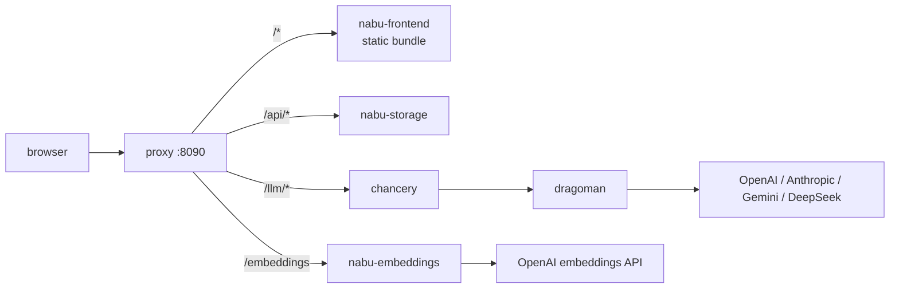

# nabu-self-hosted

nabu-self-hosted is a deploy repository that runs the whole Nabu stack — nabu-frontend, nabu-storage, nabu-embeddings, chancery with the nabu-prompts config, and dragoman — as one docker compose stack behind a single published origin, so that a user can clone one repo, put provider API keys in `.env`, run `docker compose up`, and open one URL. The repository contains the compose file, the reverse-proxy configuration, `.env.example`, the preflight check and welcome seed (two small programs with their build files and test fixtures), and a README that is the install guide; every service builds from its own repository via a git build context. Two component repositories each take one small patch to fit: chancery accepts a `/responses` suffix on agent routes, and nabu-frontend learns to build same-origin URLs.

## Components

- [compose.md](compose.md) — the stack definition: services from git build contexts, the user-facing env knobs, models preset selection, and startup gating.
- [proxy.md](proxy.md) — the Caddy reverse proxy, the only published port; owns the public path map every other component points at.
- [preflight.md](preflight.md) — the boot-time check that derives which provider keys the chosen models yaml needs and fails the stack before serving when one is missing.
- [chancery-responses.md](chancery-responses.md) — the patch in the chancery repository: agent routes also accept a `/responses` suffix, so any agent path works as a stock OpenAI SDK `base_url`.
- [frontend-same-origin.md](frontend-same-origin.md) — the patch in the nabu-frontend repository: a `/`-prefixed host var means same-origin, with scheme and host taken from `window.location` at runtime.
- [welcome-seed.md](welcome-seed.md) — the one-shot service that creates a welcome project when storage is empty, so a first boot lands inside a project via the app's existing first-project redirect.

## Data flow

The diagram shows one thing: every request the browser makes enters through the proxy's single origin, and no provider key ever reaches the browser — dragoman holds the model keys behind chancery, unexposed, and the embeddings service attaches its key server-side on its one relayed path.

## Walking skeleton

The first thing built and tested is the thinnest end-to-end slice that touches every new or changed component, threaded through the real stack.

From a clean clone with only `OPENAI_API_KEY` set and every other knob on its default: the preflight passes, every service reaches healthy, and three round trips succeed through the one origin — the app loads in a browser, is redirected into the welcome project the [welcome seed](welcome-seed.md) created, and syncs its files over the WebSocket at `/api/ws/{projectId}`; an edit to the welcome document writes through `/api/commands/{projectId}`; one request to `/llm/<agent>/responses` in the stock SDK path shape returns a streamed model response; one `POST /embeddings` returns vectors. That single boot exercises the compose graph, the preflight, all four proxy routes, the frontend's same-origin API URLs, and chancery's suffix resolution — the places integration surprises live.

To run it the user needs: Docker with compose, an OpenAI API key, a browser, and network access to GitHub (build contexts) and to OpenAI.

## What must not change

Every component repository keeps working standalone; the stack only adds to them.

- Chancery's existing routes — `POST /<agent-path>` and `POST /<agent-path>.<model>`, without suffix — behave exactly as today, pinned by the existing tests in `chancery/internal/handlers/http/` (`chat_test.go`, `routes_test.go`). The suffix patch is resolution-order only.
- Dragoman changes not at all; no file in it is touched.
- nabu-storage and nabu-embeddings change not at all; the proxy consumes their existing surfaces.
- The nabu-prompts compose stack (chancery + dragoman standalone) keeps booting and serving unmodified, since the chancery patch is additive.
- The frontend's bare-host URL building has no existing test pinning it, so it is pinned here before the component is built: given `VITE_API_HOST` holds a bare host such as `localhost:8080`, when the app builds API and WebSocket URLs on a page served over `http:`, then the URLs are `http://localhost:8080/<path>` and `ws://localhost:8080/<path>`, unchanged from today; and the same values over `https:` yield `https://` and `wss://`.
- The home route's first-project redirect (`app/routes/home.tsx` navigates to the first project once the list loads) has no test pinning it and the welcome seed relies on it, so it is pinned here: given a project list with at least one project, when the home route loads, then the app navigates to the first project.
